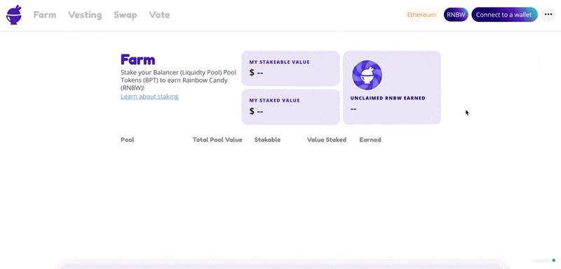

# How to Connect Your Wallet

Setting up a wallet is needed to be able to use HaloDAO's products. Below is a list of supported wallets, click the link and follow the instructions to set up a wallet and create your own account.

* [Metamask](https://metamask.io/)


**Please remember to backup your seed phrase and your private key.**


Connect Metamask \(or any supported wallet\) on the HaloDAO site.

1. Go to [https://app.halodao.com](../)
2. Click the "Connect to Wallet" button on the upper right.
3. Select Metamask \(or any wallet from the list\).
4. On Metamask, click "Next".
5. And click "Confirm".


Make sure you are connected to the **Ethereum** **Mainnet** \(other networks to be supported soon after launch\).


