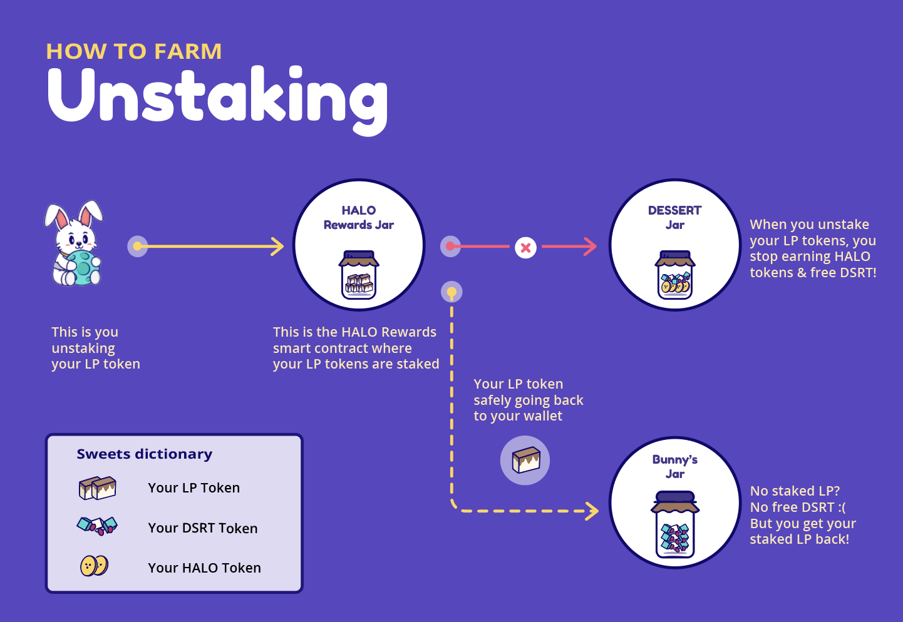
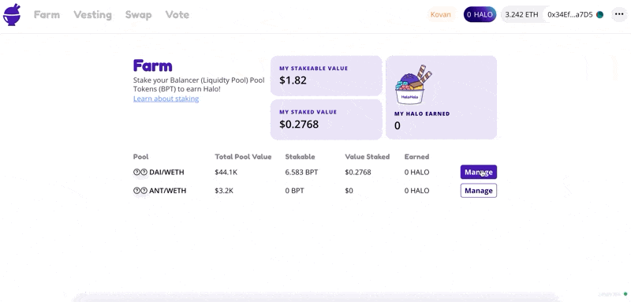

# How to Farm \(Staking & Unstaking\)

## **How to Stake**

1. Go to [app.halodao.com](https://app.halodao.com).
2. Go to the Farm tab if not automatically redirected.
3. Select a liquidity pool where you wish to add liquidity to, click “Manage”.
4. Follow the link to get more BPT tokens if you don’t have any.
5. Enter the amount of BPT you want to stake. 
6. Click “Stake” button.
7. Your LP tokens will be staked into the HALO Rewards smart contract. 
8. You will get a proportionate amount of HALO Rewards from your staked BPT tokens relative to the total liquidity provided.
9. You will earn HALO rewards tokens proportionate to your BPT staked out of the total BPT staked in the Rewards contract. 
10. The HALO rewards that you earn from staking will be automatically vested into the Rainbow smart contract.
11. You will receive Rainbow Drops \(RNBW\). 
12. The longer you hold RNBW, the more HALO you receive over time. Read the next section, [How Vesting Works](../../products/dessert-pool/how-vesting-works.md), to understand how this is calculated.

## **How to Unstake**

1. Go to [app.halodao.com](https://app.halodao.com)
2. Go to the Farm tab if not automatically redirected
3. Select a liquidity pool where you wish to remove liquidity from, click “Manage”.
4. Enter the amount of BPT you want to unstake. 
5. Click “Unstake” button.
6. Your LP tokens will be unstaked from the HALO Rewards smart contract and withdrawn to your wallet. 
7. You will stop getting HALO rewards proportionate to the LP tokens you've unstaked. 

