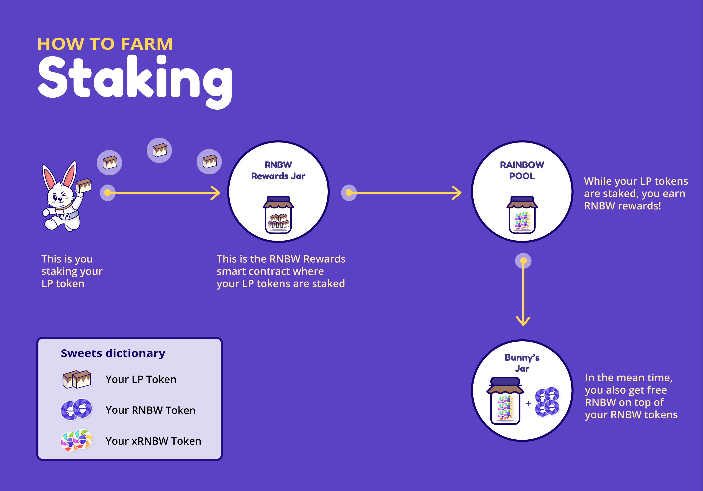

# How to Farm \(Staking & Unstaking\)

## **How to Stake Balancer Pool Tokens \(BPT\)**

1. Go to [app.halodao.com](https://app.halodao.com).
2. Go to the Farm tab if not automatically redirected.
3. Select a liquidity pool where you wish to add liquidity to, click “Manage”.
4. Follow the link to get more BPT tokens \(Only needed if BPT balance is 0, otherwise, skip this step\).
5. Enter the amount of BPT you want to stake. 
6. Click “Stake” button.
7. Your LP tokens will be staked into the RNBW Rewards smart contract. 
8. You will get a proportionate amount of xRNBW vesting tokens from your staked BPT tokens relative to the total BPT staked for that pool.
9. The longer you hold xRNBW, the more RNBW you receive over time. Read the next section, [How Vesting Works](../../products/rainbow-pool/how-vesting-works.md), to understand how this is calculated.

## **How to Unstake?**

1. Go to [https://app.halodao.com/\#/](https://app.halodao.com/#/vesting)farm
2. Go to the Farm tab if not automatically redirected
3. Select a liquidity pool where you wish to remove liquidity from, click “Manage”.
4. Enter the amount of BPT you want to unstake. 
5. Click “Unstake” button.
6. Your LP tokens will be unstaked from the RNBW Rewards smart contract and withdrawn to your wallet. 
7. You will stop getting xRNBW vesting tokens proportionate to the LP tokens you've unstaked. 
8. Any existing xRNBW vesting tokens will still accrue RNBW the longer you hold it, but you may claim your RNBW at any time by going to [https://app.halodao.com/\#/vesting](https://app.halodao.com/#/vesting)

