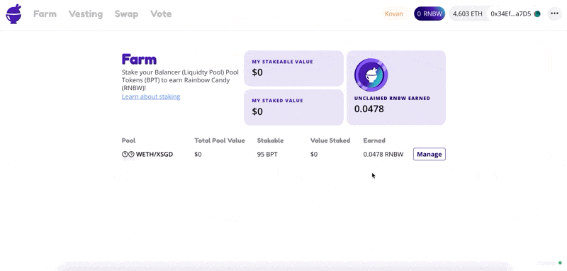

# How to Harvest

1. Go to [app.halodao.com](https://app.halodao.com).
2. Go to the Farm tab if not automatically redirected.
3. Select a liquidity pool where you wish to harvest from, click “Manage”.
4. Click the "Harvest" button.

