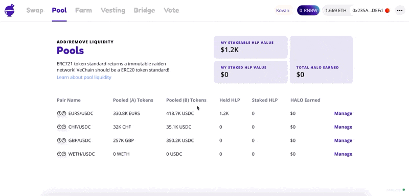

# How to Remove Liquidity from HaloDAO Liquidity Pools

1. Click this link [https://app.halodao.com/\#/pool](https://app.halodao.com/#/pool) to go to the Pool page
2. Select a pool where you wish to add liquidity to and click “Manage” on that pool
3. Click on Remove Liquidity tab
4. Input amount you wish to remove by dragging the amount slider or clicking any of the % amount buttons.
5. Click “Remove Supply”

