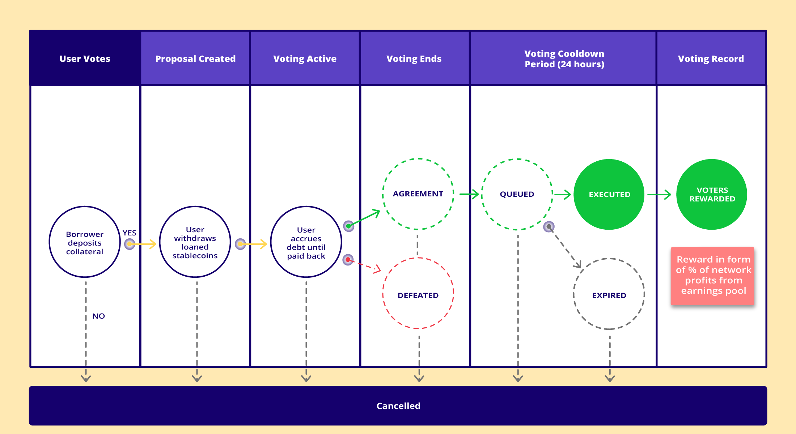

# ⚡️ Voting and Proposals

HaloDAO's voting portal will allow any RNBW token holder to stake and vote on proposals initiated by other RNBW token holders. Your voting rights are directly proportional to the number of RNBW tokens \
you own.

RNBW token holders can propose and vote for:

* New economic and geographic regions to expand to. 
* New collateral types and synthetics to support across the AMM, and Lending Market.
* Adjust the RNBW burn rate. (to lessen the total RNBW supply over time, funded by the Stablecoin Earnings Pools)
* When to execute buybacks using funds from the Stablecoin Earnings Pools.
* And many other proposal types

#### **Informal Discussion**

.png>)

The proposal and voting process begins with informal and high-level proposals on Discord and other channels the community chooses. That would be followed by intermediate proposals with some level of detail on Discourse, which could also be linked to proposed changes outlined in a Pull Request or Issue to the HaloDAO Github.

#### **Formal Proposal and Voting**


Refer to the [governance roadmap](../roadmap/governance-roadmap.md) for the approx. schedule of version releases.

