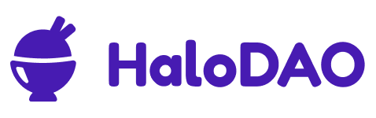
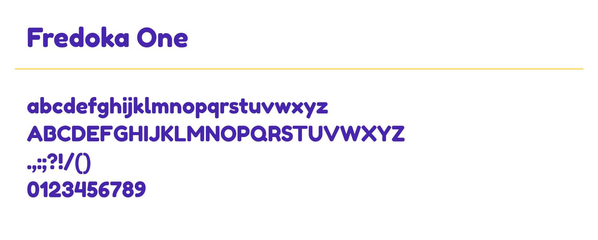
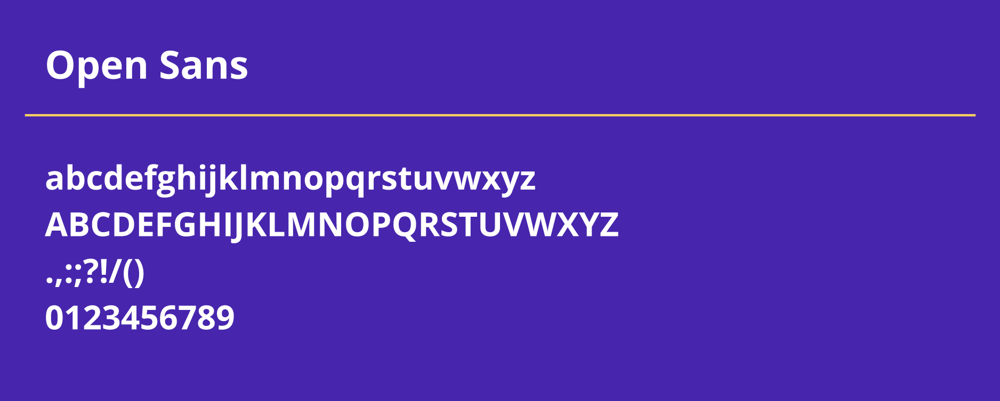
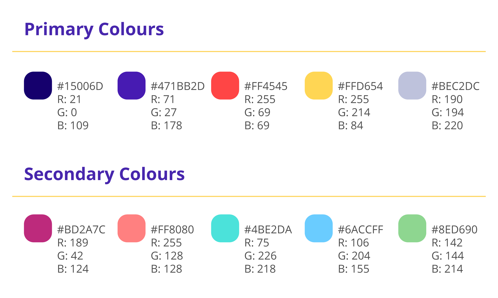

# HaloDAO Brand Assets

This page is where the official HaloDAO's Logo and branding assets can be downloaded for use in articles, designs and/or user interfaces.

### Logo

#### Main Logo











#### Logomark











#### Rainbow Candy \(RNBW\)







#### Rainbow Pool \(xRNBW\)







### Mascot



The zipped folder consists of Heyhey in multiple poses.

### Typography

#### Titles/Headers

#### Bodycopy

### Brand Colours

### Social Media



