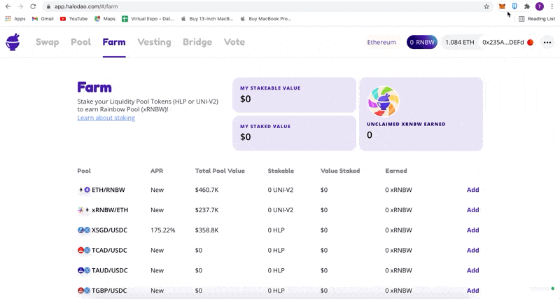

# How to add Polygon network in Metamask

1. Delete the current Polygon (Matic) network from Metamask. (You can skip this if you haven't added it yet)
2. Switch back to Ethereum mainnet.
3. Go to the [Bridge](https://app.halodao.com/#/bridge) page and tap our network switcher (upper right to the left of the RNBW balance).
4. Choose Polygon (Matic) network
5. Tap `Approve` (this will automatically add the new RPC URL that works and loads the Farm and Pool pages [https://polygon-rpc.com/](https://polygon-rpc.com/))

