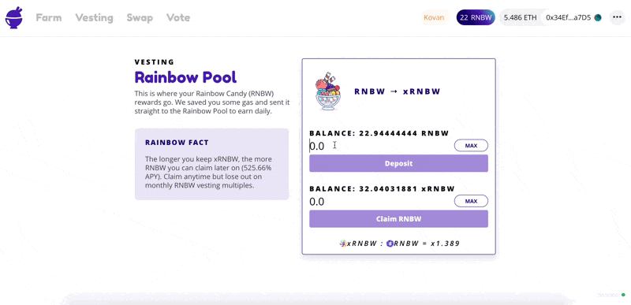

# How to Vest (RAINBOW POOL) - ETH Mainnet

### How to manually vest your RNBW tokens (ONLY for ETH Mainnet)

1. Go to [https://app.halodao.com/#/](https://app.halodao.com/#/vesting)
2. Go to the “Vest” tab.&#x20;
3. Click “Deposit.”
4. Confirm the Metamask transaction.
5. You will receive xRNBW vesting tokens at the current price of xRNBW:RNBW.


Applicable for those who bought RNBW from the market or previously claimed it from Vesting.


###
