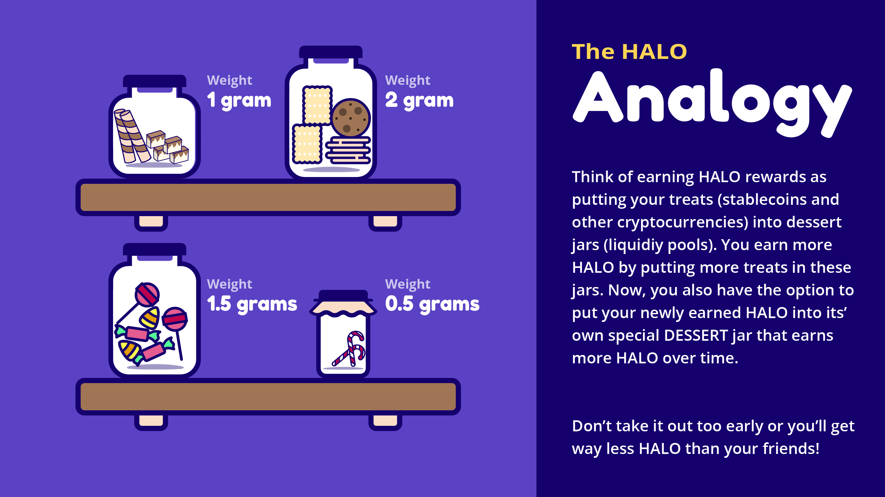

# 🔁 AMM/EXCHANGE \(Farm\)

HaloDAO will incentivise liquidity provision and trading between Asian asset-backed stablecoins, synthetic stablecoins, and important pairings between those stablecoins and popular currencies, such as ETH, WBTC, USDC, USDT, DAI, etc. 

#### ✅Here are some tips to maximize liquidity for the following pairs:



* Arbitrage opportunity between claiming from the Dessert Pool and exchange.
* Increases incentive to hold DSRT.



* USDT pairing is enough to concentrate HALO rewards for higher APY and because balancer will find multihop swaps into USDC, DAI anyway. For example, when swapping xSGD:USDC, it will go xSGD → USDT → USDC on its own.



