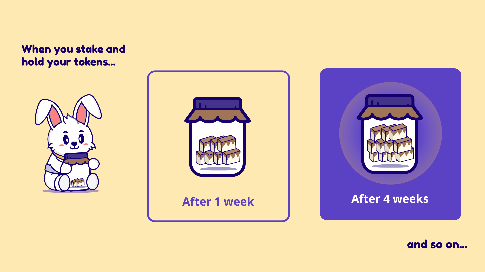

# 🌈 Rainbow Pool


**The Rainbow contract is HaloDAO’s vesting mechanism that incentivizes you to hold HALO longer, but without locking you into a fixed vesting schedule.**


Rainbow pool is the vesting contract that allows users to continue earnings high yields on HALO without impermanent loss. A user's HALO tokens can still be withdrawed anytime. The tradeoff is that the user will stop accumulating monthly HALO vesting rewards via RNBW. 

The protocol enables this by allocating 20% of monthly HALO liquidity rewards over 5 years into the vesting contract.  

