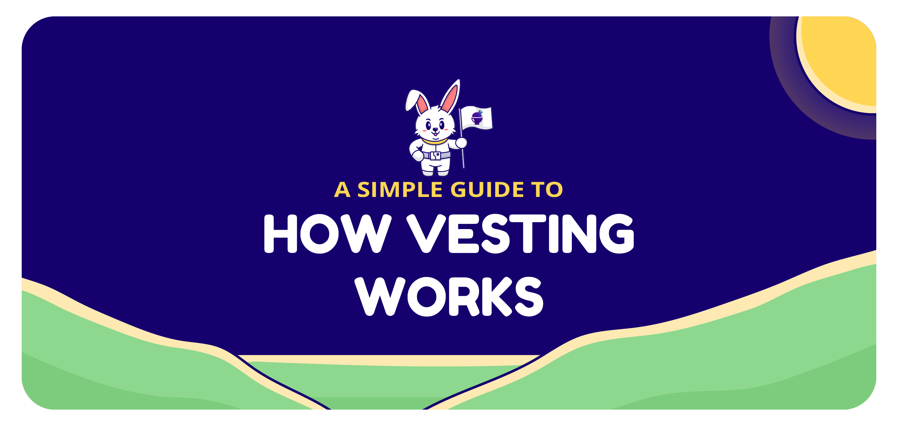

# How Vesting Works

1. When a user stakes their LP tokens from the [Farm page](https://app.halodao.com), they will be rewarded with HALO tokens proportionate to their LP tokens. 
2. Their HALO tokens are automatically deposited into the Rainbow contract.
3. Their wallet will be credited with Rainbow Drop tokens \(RNBW\) as they earn HALO rewards.

The following is a walkthrough on how holding RNBW gives them more HALO over time:

Let’s make the following assumptions using the classic Alice and Bob example:

1. 1 epoch is 1 day \(in real life it will be 1 month\)
2. HALO Vesting Reward is equal to 1 HALO
3. HALO Vesting Reward is paid out per epoch
4. Alice earns 1 HALO in 1 epoch for supplying liquidity to HaloDAO
5. Alice is the first liquidity provider of the protocol during epoch 1
6. In epoch 2, Bob then provides liquidity after Alice and also earns 1 HALO in epoch 2

| Event | Epoch | Action | RNBW:HALO price | RNBW:HALO total supply |
| :--- | :--- | :--- | :--- | :--- |
| Alice earns 1 HALO | 1 | 1 HALO auto deposited to Rainbow contract |  |  |
| Alice receives 1 RNBW | 1 | Rainbow contract mints 1 RNBW and locks 1 HALO | 1 RNBW = 1 HALO | 1 RNBW, 1 HALO |
| 1 HALO vesting reward sent to Rainbow contract by protocol | 1 | No RNBW is minted, which increases the price of RNBW relative to HALO | 1 RNBW = 2 HALO | 1 RNBW, 2 HALO |
| Bob earns 1 HALO | 2 | 1 HALO auto deposited to Rainbow contract |  |  |
| Bob receives 0.5 RNBW | 2 | Rainbow contract mints 0.5 RNBW and locks 1 HALO | 1 RNBW = 2 HALO | 1.5 RNBW, 3 HALO |
| 1 HALO vesting reward sent to Rainbow contract by protocol | 2 | No RNBW is minted, which increases the price of RNBW relative to HALO | 1 RNBW = ~2.67 HALO | 1.5 RNBW, 4 HALO |
| Alice claims HALO using 1 RNBW | 2 | 1 RNBW is burned, 2 HALO is withdrawn from Rainbow contract | 1 RNBW = ~2.66 HALO | 0.5 RNBW, 1.33 HALO |
| Bob claims HALO using 0.5 RNBW | 2 | 0.5 RNBW is burned, 1.33 HALO is withdrawn from Rainbow contract | 0 RNBW = 0 HALO | 0 RNBW, 0 HALO |
| Alice earns 1 HALO | 3 | 1 HALO auto deposited to Rainbow contract |  |  |
| Alice receives 1 RNBW | 3 | Rainbow contract mints 1 RNBW and locks 1 HALO | 1 RNBW = 1 HALO | 1 RNBW, 1 HALO |

Over time as HALO vesting rewards are deposited into the Rainbow vesting contract the price of RNBW in terms of HALO will increase. Of course, 1 epoch will not just be 1 day but 1 month in actual operations, and Alice and Bob in this example won’t necessarily claim all HALO and burn total RNBW supply \(thus resetting RNBW:HALO price\) at the same time,  but this serves as a simple simulation of the vesting mechanism. If you think this sounds familiar, that is because we forked the Rainbow contract from Sushi’s SushiBar but made some slight changes, namely;

1. Instead of a ⅔ vesting schedule, the liquidity provider will automatically earn HALO rewards from the Rainbow contract and give the liquidity provider RNBW. We figured this approach would save the user gas, automatically vest the user to earn more HALO \(as long as you stick around for at least a month interval\) but still allow the flexibility of real-time withdrawal at any time.
2. In addition to depositing network profits \(exact amount and time interval to be determined after HaloDAO profit drivers are enabled at AMM and Lending Market launch\), 20% of monthly HALO liquidity rewards over 5 years will be sent to the Rainbow vesting contract every month. This increases RNBW APY and further incentivises long-term holding.

