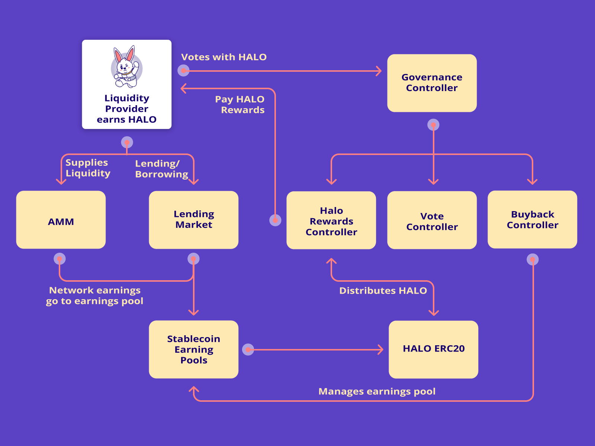

# 🔭 Protocol Overview

HaloDAO aims to incentivize and build asset-backed stablecoin liquidity by establishing the foundational money lego of DeFi. However, rather than using ETH or BTC to generate synthetic USD stablecoins as initial protocols have done, HaloDAO caters to;

1. Stablecoin liquidity for market-making in an AMM.
2. Stablecoin lending and borrowing in a Lending Market 

You will notice the building blocks of liquidity within the use case columns, namely USD stablecoins and LP tokens for stablecoin liquidity pools that can all be used to stack liquidity yield for increasing APYs that in turn attract more liquidity into these 3 fundamental DeFi use cases. An example of how this would work is the classic DeFi yield farming sequence:

1. Lend stablecoin A and stablecoin B at a certain ratio to a liquidity pool and receive an LP token as claim against the collateral
2. Take that LP token and lend it in the Lending Market to borrowers who then pay a fee to the lender, receiving a wrapped token representing lent collateral.
3. Take that wrapped token and use it as collateral to mint synthetic stablecoins.

This classic example of stacking liquidity between 3 foundational use cases is how DeFi’s total value locked \(TVL\) went from a few hundred million to roughly 40B USD at the time of writing. HaloDAO aims to replicate and incentivize these flows to build stablecoin liquidity in order to facilitate sufficient market depth in various local markets and enable permissionless commerce.

The core modules \(AMM, Lending Market and Stablecoin Minter\) enable the:

1. Swapping of region-specific asset-backed stablecoins and synthetic versions where applicable.
2. Minting and redemption of region-specific stablecoins.
3. Lending and borrowing of these region-specific stablecoins.
4. The earning of HALO rewards for actions along with the profit drivers of the above.
5. Governance of the HaloDAO Protocol by HALO token holders.

