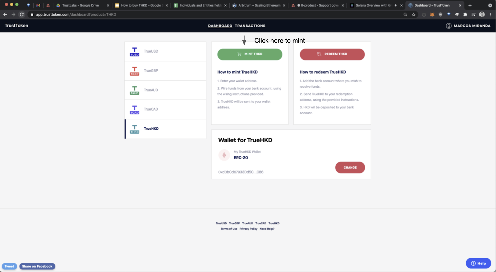
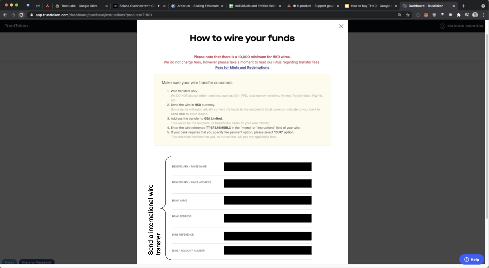

# 🇭🇰 THKD

Official Site:  [http://app.trusttoken.com/](http://app.trusttoken.com/)  

**What is THKD \(TrueHKD\)?**

TrueHKD is fully collateralized by Hong Kong dollars and was first issued in June 2019 with Legacy Trust supporting as Hong Kong-licenced digital asset custody provider. 

**Who is the issuer entity and what is the governing regulation/license?**

TrustTokens are regulated in the US, TrueCurrencies are managed by TrueCoin, LLC - a registered Money Service Business \(MSB\) in the United States  

**Where can I purchase THKD?**

True HKD can be purchased in the TrustToken app and allow Hong Kong residents as well as other users who hold Hong Kong Dollars, to access TrustToken’s global network of exchanges, partners and wallets.

Step 1: Visit [https://app.trusttoken.com](https://www.google.com/url?sa=t&rct=j&q=&esrc=s&source=web&cd=&ved=2ahUKEwiP67fMqtjwAhUB4HMBHcCWCVkQFjAAegQICBAD&url=https%3A%2F%2Fapp.trusttoken.com%2F&usg=AOvVaw2xarHzmgJqKvGZZC_yxAP8) and create an account

Step 2: Complete the KYC/AML check

Step 3: Select THKD and Add you Wallet

Step 4: Click Mint THKD

Step 5: Wire funds directly to the escrow account  

Step 6: Once funds have arrived to the account, THKD corresponding to the number of dollars will be sent  

More details can be found [here](https://blog.trusttoken.com/how-to-purchase-and-redeem-trueusd-a-guide-for-traders-ad8b141a9039)

**To mint/redeem:** Visit [Trust Token](https://www.trusttoken.com/) 

**Links:** 

* [CoinGecko](https://www.coingecko.com/en/coins/true-hkd)
* [Etherscan](https://etherscan.io/token/0x0000852600ceb001e08e00bc008be620d60031f2)   

