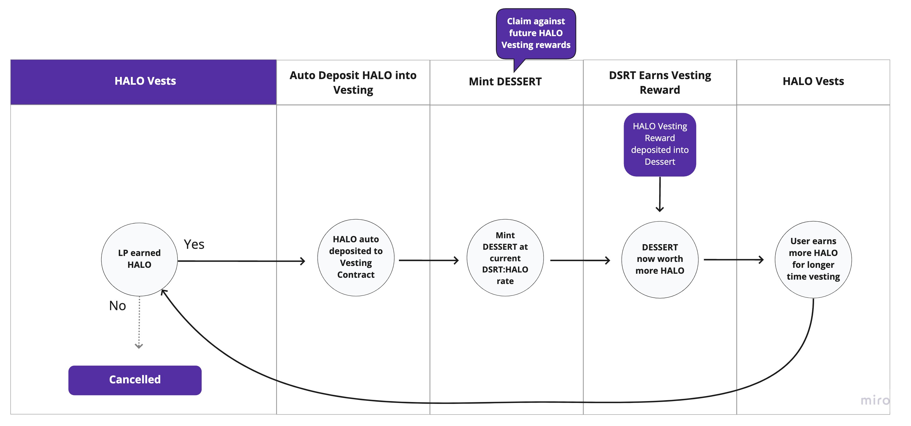

# How Vesting Works

The DESSERT smart contract is HaloDAO’s vesting mechanism that incentivises you to hold HALO longer, but without locking you into a fixed vesting schedule. Its’ the best of both worlds where you gain high APYs on HALO without impermanent loss and without too much smart contract risk but are still able to withdraw at will \(you’ll just lose out on monthly HALO rewards\). 

1. When you stake your LP tokens in the HALO Rewards contract, you will get HALO tokens proportionate to your LP token liquidity provided as rewards. You can do this from the [Farm page](https://app.halodao.com) 
2. The HALO tokens you got from staking and the HALO tokens you earn from rewards will automatically be staked in the DESSERT Contract. Refer to figure 1 above for the explanation of DESSERT contract.
3.  Your wallet will be credited with DSRT tokens as you earn HALO rewards.

### How **to claim HALO rewards from Vesting**

1. Go to [app.halodao.com](https://app.halodao.com).
2. Go to the “Vest” tab.
3. Click “Claim HALO.”
4. If you have DSRT balance, you will automatically receive the proportionate amount of HALO it is worth at time of claiming.
5. \(Optional\) Watch DSRT go up in HALO value.

### How to manually vest your HALO tokens \(if you bought it off the market or previously claimed it from Vesting\)

1. Go to [app.halodao.com](https://app.halodao.com).
2. Go to the “Vest” tab.
3. Click “Deposit.”
4. Confirm the Metamask transaction.
5. You will receive DSRT tokens at the current price of DSRT:HALO.
6. \(Optional\) Watch DSRT go up in HALO value.

The protocol enables this by allocating 20% of monthly HALO liquidity rewards over 5 years into the vesting contract. As the protocol is built out, governance may also allocate network profits into the vesting contract to increase vesting APY even further, though the exact timing and mechanism of this will be decided closer to our v1 launch. 

The following is a walkthrough on how holding Dessert \(DSRT\) gives you more HALO over time:

Let’s make the following assumptions using the classic Alice and Bob example:

1. 1 epoch is 1 day \(in real life it will be 1 month\)
2. HALO Vesting Reward is equal to 1 HALO
3. HALO Vesting Reward is paid out per epoch
4. Alice earns 1 HALO in 1 epoch for supplying liquidity to HaloDAO
5. Alice is the first liquidity provider of the protocol during epoch 1
6. In epoch 2, Bob then provides liquidity after Alice and also earns 1 HALO in epoch 2

| Event | Epoch | Action | DSRT:HALO price | DSRT:HALO total supply |
| :--- | :--- | :--- | :--- | :--- |
| Alice earns 1 HALO | 1 | 1 HALO auto deposited to DESSERT |  |  |
| Alice receives 1 DESSERT | 1 | DESSERT contract mints 1 DSRT and locks 1 HALO | 1 DSRT = 1 HALO | 1 DSRT, 1 HALO |
| 1 HALO vesting reward sent to DESSERT contract by protocol | 1 | No DESSERT is minted, which increases the price of DSRT relative to HALO | 1 DESSERT = 2 HALO | 1 DESSERT, 2 HALO |
| Bob earns 1 HALO | 2 | 1 HALO auto deposited to DESSERT |  |  |
| Bob receives 0.5 DSRT | 2 | DESSERT contract mints 0.5 DSRT and locks 1 HALO | 1 DSRT = 2 HALO | 1.5 DSRT, 3 HALO |
| 1 HALO vesting reward sent to DESSERT contract by protocol | 2 | No DSRT is minted, which increases the price of DESSERT relative to HALO | 1 DSRT = ~2.67 HALO | 1.5 DSRT, 4 HALO |
| Alice claims HALO using 1 DSRT | 2 | 1 DSRT is burned, 2 HALO is withdrawn from DESSERT vesting contract | 1 DSRT = ~2.66 HALO | 0.5 DSRT, 1.33 HALO |
| Bob claims HALO using 0.5 DSRT | 2 | 0.5 DSRT is burned, 1.33 HALO is withdrawn from DESSERT Vesting contract | 0 DSRT = 0 HALO | 0 DSRT, 0 HALO |
| Alice earns 1 HALO | 3 | 1 HALO auto deposited to DESSERT |  |  |
| Alice receives 1 DSRT | 3 | DESSERT contract mints 1 DSRT and locks 1 HALO | 1 DSRT = 1 HALO | 1 DSRT, 1 HALO |

As you can see, over time as HALO vesting rewards are deposited into the DESSERT vesting contract the price of HALOHAO in terms of HALO will increase. Of course, 1 epoch will not just be 1 day but 1 month in actual operations and Alice and Bob in this example won’t necessarily claim all HALO and burn total DESSERT supply \(thus resetting DESSERT:HALO price\) at the same time,  but this serves as a simple simulation of the vesting mechanism. If you think this sounds familiar, that is because we forked the DESSERT contract from Sushi’s SushiBar but made some slight changes, namely;

1. Instead of a ⅔ vesting schedule, we automatically transfer all earned HALO rewards daily \(gas on us\) to the DESSERT contract and give the liquidity provider DSRT. We figured this approach would save the user gas, automatically vest the user to earn more HALO \(as long as you stick around for at least a month interval\) but still allow the flexibility of real time withdrawal at any time.
2. In addition to depositing network profits \(exact amount and time interval to be determined after HaloDAO profit drivers are enabled at AMM, Lending Market and Synthetic Minter launch\), 20% of monthly HALO liquidity rewards over 5 years will be sent to the DESSERT vesting contract every month. This increases DSRT APY and further incentivises long term holding.

