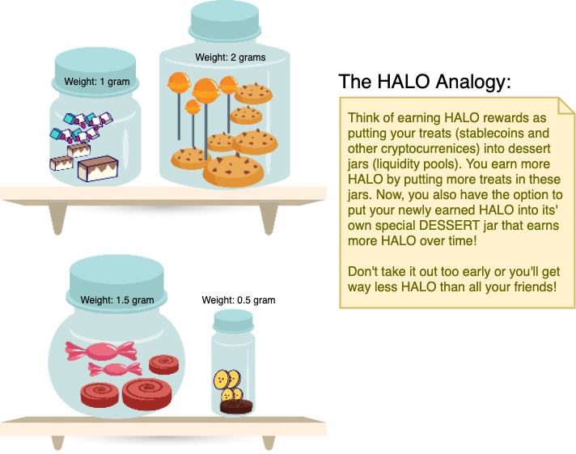

# How to Supply Liquidity

## How to get Balancer Pool Tokens \(BPT\)

In v0, we are using Balancer Liquidity Pools to bootstrap our stablecoin liquidity. Here are the steps to acquire some, then use them to earn HALO:

1. Go to Farm
2. Select a pool where you wish to add liquidity to, click “Manage”.
3. Click “To stake, get BPT tokens here” link.
4. You will be redirected to the pool in balancer.exchange.
5. Enter the amount of liquidity you will provide.
6. Click deposit.
7. You should receive your BPT tokens. 

\(content will be updated once Balancer pools have been set up\)  


Click [**here**](../core-concepts-1/automated-market-maker.md) to know more about our AMM


